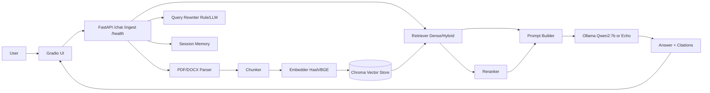

# RAG-based-Intelligent-Document-Q-A-System

一个面向中文场景的 RAG 文档问答系统，支持 PDF/Word 文档上传、语义分块、向量检索、混合检索、重排序、查询改写、多轮对话记忆与引用溯源。

本项目目标是提供一个可运行、可复现、可量化评估的端到端 Demo，后续工程化扩展。

## 1. 项目简介与功能特性

已实现能力：

- 文档解析：支持 `.pdf` 与 `.docx`
- 语义分块：可配置 `chunk_size` 与 `chunk_overlap`
- 向量化与存储：支持 Hash/BGE 嵌入，Chroma 持久化
- 检索策略：`dense`、`hybrid`（Dense + BM25）、`hybrid_rerank`
- 查询改写：规则改写 + LLM 改写（可开关）
- 生成与溯源：答案返回结构化引用，包含 `index/score/quote_excerpt`
- 多轮对话：按 `session_id` 管理历史轮次并参与后续检索
- API 服务：`/health`、`/ingest`、`/chat`
- 前端 Demo：Gradio 上传与问答界面
- 容器化：`Dockerfile` + `docker-compose.yml` 一键启动 API/UI

## 2. 技术架构图



## 3. 技术栈说明

| 模块 | 选型 |
|---|---|
| 语言 | Python 3.11+ |
| RAG 编排 | 自定义 Pipeline + LangChain Text Splitters |
| 向量库 | Chroma |
| 稀疏检索 | rank-bm25 |
| 嵌入模型 | BAAI/bge-small-zh-v1.5（可选） |
| 重排序 | TokenOverlapReranker（当前）/BGE Reranker（预留） |
| 解析 | PyMuPDF + python-docx |
| 后端 | FastAPI + Uvicorn |
| 前端 | Gradio |
| LLM 推理 | Ollama (qwen2:7b) |
| 部署 | Docker + Docker Compose |

## 4. 快速开始

## 4.1 环境要求

- Windows 10/11（或 Linux/macOS）
- Python 3.11+
- Git
- Ollama（本地模型推理）
- Docker Desktop（容器化运行）

## 4.2 依赖安装

```powershell
cd D:\vscode项目\RAG-based-Intelligent-Document-Q-A-System
python -m venv .venv
.\.venv\Scripts\Activate.ps1
python -m pip install --upgrade pip
pip install -r requirements.txt
```

## 4.3 本地模型准备（可选，真实 LLM）

```powershell
ollama pull qwen2:7b
ollama run qwen2:7b
```

## 4.4 本地启动（非 Docker）

启动 API：

```powershell
python -m uvicorn app.api.main:app --host 127.0.0.1 --port 8000
```

新开终端启动 UI：

```powershell
python scripts/run_ui.py --api-base-url http://127.0.0.1:8000 --host 127.0.0.1 --port 7860
```

访问：

- API 文档: http://127.0.0.1:8000/docs
- UI: http://127.0.0.1:7860

## 4.5 Docker 一键启动

```powershell
docker compose up --build
```

健康检查：

```powershell
curl http://127.0.0.1:8000/health
```

停止：

```powershell
docker compose down
```

Windows 常见问题：若报 `docker_engine` npipe 连接失败，通常是 Docker Daemon 未启动或 WSL 未安装。

## 5. API 使用示例

## 5.1 Health

```bash
curl http://127.0.0.1:8000/health
```

## 5.2 Ingest

```bash
curl -X POST http://127.0.0.1:8000/ingest \
	-F "files=@phase1_manual.docx" \
	-F "chunk_size=500" \
	-F "chunk_overlap=50" \
	-F "embedder=hash"
```

## 5.3 Chat

```bash
curl -X POST http://127.0.0.1:8000/chat \
	-H "Content-Type: application/json" \
	-d '{
		"question": "公司请假制度每年有多少天年假？",
		"top_k": 5,
		"embedder": "hash",
		"llm": "echo",
		"retrieval_mode": "hybrid_rerank",
		"query_rewrite": true,
		"rewrite_mode": "rule",
		"use_session_memory": true,
		"session_id": "demo-session"
	}'
```

## 6. 效果展示

## 6.1 当前测试截图

当前仓库尚未提交 UI 截图文件。建议补充以下截图后上传到仓库：

- 文档上传成功界面
- 问答结果与引用展示界面
- 多轮追问示例界面

## 6.2 真实测试数据对比（当前阶段）

以下数据来自本地已执行测试，使用 `phase1_manual.docx` 与 2 条问答样本，`top_k=5`，`embedder=hash`，`llm=echo`。

| 配置 | 样本数 | Top-5 命中率 | 平均响应时间（ms） |
|---|---:|---:|---:|
| dense | 2 | 1.0000 | 4.74 |
| hybrid | 2 | 1.0000 | 6.35 |
| hybrid_rerank | 2 | 1.0000 | 5.41 |

说明：

- 以上是小样本烟雾数据，用于确认链路可用，不代表最终效果上限。
- Phase 4 将扩展到 50-100 条评测集，统计更稳定的准确率、幻觉率与延迟指标。

Phase 4 Step 2 已新增指标与产物：

- strict_citation_hit_rate（按 source_file + source_location 严格匹配）
- 主题分组统计 JSON（annual_leave / probation_rule / out_of_scope）
- 结果文件：
	- vectorstore/mode_eval/results_modes.csv
	- vectorstore/mode_eval/results_modes_topics.json

Phase 4 Step 3 已完成 Ollama 对比评测（qwen2:7b）：

- 对比文件：
	- vectorstore/mode_eval/results_modes_echo.csv
	- vectorstore/mode_eval/results_modes_ollama.csv
- 结论摘要：
	- 在当前 10 条样本上，Ollama 在 `hybrid`、`hybrid_rerank` 的 answer_hit_rate 高于 Echo
	- strict_citation_hit_rate 在两类模型上均为 0.8000
	- Ollama 明显改善 out_of_scope 场景的拒答相关指标（hallucination_proxy_rate 降低）
	- 代价是延迟显著上升（毫秒级 -> 秒级）

Phase 4 Step 4 已完成 60 条扩展评测：

- 结果文件：
	- vectorstore/mode_eval/results_modes_echo_60.csv
	- vectorstore/mode_eval/results_modes_ollama_60.csv
	- vectorstore/mode_eval/results_modes_topics_ollama_60.json
- 关键结论：
	- 在 60 条样本上，Ollama 三种模式的 answer_hit_rate 均显著高于 Echo
	- strict_citation_hit_rate 在两类模型上保持一致（0.7000）
	- Ollama 将 hallucination_proxy_rate 从 1.0000 降到 0.0000，但带来约 3.5s~4.3s 的平均延迟

## 7. 项目结构

```text
RAG-based-Intelligent-Document-Q-A-System/
	app/
		api/
			main.py
		rag/
			parser.py
			chunker.py
			embeddings.py
			vectorstore.py
			retriever.py
			hybrid_retriever.py
			reranker.py
			query_rewriter.py
			generator.py
			conversation_memory.py
			evaluation.py
			pipeline.py
		ui/
			gradio_app.py
	scripts/
		check_env.py
		ingest.py
		chat_cli.py
		evaluate_chunk_params.py
		run_ui.py
	Dockerfile
	docker-compose.yml
	requirements.txt
```

## 8. 开发与测试

常用测试命令：

```powershell
python -m pytest -q tests/test_parser.py
python -m pytest -q tests/test_api_phase3_step1.py
python -m pytest -q tests/test_gradio_app.py
python -m pytest -q tests/test_docker_assets.py
```

参数实验命令：

```powershell
python scripts/evaluate_chunk_params.py \
	--docs phase1_manual.docx \
	--eval-json your_eval_dataset.json \
	--chunk-sizes 300,500,800 \
	--overlaps 0,50,100 \
	--top-k 5 \
	--embedder hash \
	--workspace-store-dir vectorstore/chunk_param_eval \
	--out-csv vectorstore/chunk_param_eval/results.csv
```

## 9. 当前状态

- Phase 1：完成
- Phase 2：完成（混合检索、重排序、查询改写、分块参数实验）
- Phase 3：完成（API、引用溯源、多轮记忆、Gradio、Docker）
- Phase 4：进行中（Step 1~4 已完成：模式基线 + 严格引用命中 + 主题分组 + Ollama 对比 + 60 条扩展评测）

## 10. 未来规划

- 用 BGE 嵌入 + BGE Reranker 跑完整评测集
- 增加答案引用准确率与幻觉率自动评估脚本
- 增加流式输出与前端聊天历史展示
- 增加 Milvus/pgvector 等生产向量库可插拔支持
- 增加监控、缓存与并发压测
